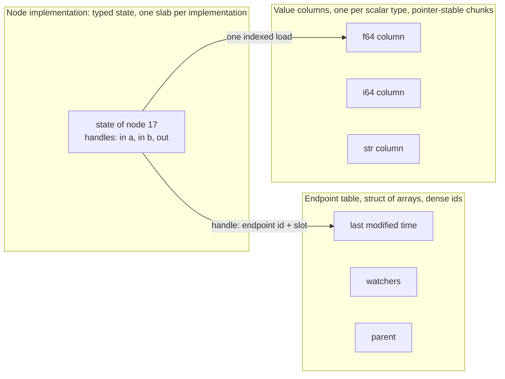

# 0009 — Designing for speed

Status: sketch

The runtime has to be very fast. Nothing that is *obviously* slow is
acceptable, in the prototype or after it. This doc turns that from an
optimisation into design rules the prototype
([0008](0008-prototype-outline.md)) is built under, and into checks that hold
it to them. It replaces positions 6 and 7 of
[0005](0005-code-shape.md).

## The idea

Settle everything at the latest moment it can be settled **once**, so that a
tick does almost nothing but the work it exists to do.

| When | What is settled there, once |
|---|---|
| Wiring | Types, overloads, rank |
| Instantiation | Storage for every time-series of the graph, reserved in one step; each node's handles to its own inputs and output |
| Binding | Where an input reads from: a direct handle to the producer's storage |
| Each tick | Only this: is it scheduled, are its inputs valid, run eval, stamp the time, tell the watchers |

## What the reference already measured

hgraph's benchmark pack (`benchmarks/results/ab-*-20260816.md`):

- An erased scalar read costs ~6 ns, inside a ~580 ns cycle. Replacing it
  with a typed fast read measured as **parity**: the payload access is not
  where the time goes.
- The time goes on the **machinery around the access**: slot views resolved
  twice per tick in the readiness check, a trust check per read, and on the
  write path "4x `MIN_DT`, 4x liveness, 5–7x `Mutable` derivations, two
  validity walks per set". Removing re-validation gave −5.0% and −1.8%;
  removing re-resolution gave −2.4% and −1.9%.

The lesson is the table above: resolve once, validate once, then trust.

## Banned on the per-tick path

1. **Heap allocation.** Steady state allocates nothing. Buffers that vary in
   size keep their capacity.
2. **Looking things up by name.** No hashing or string comparison to find an
   input, a node, a field or a type. Names become indices at instantiation.
   (Hashing a dictionary *key* is data, and is fine — with a fast hasher.)
3. **Reference counting and run-time borrow checks**: `Rc`, `Arc`,
   `RefCell`, `Mutex`.
4. **Deciding a type per value.** No downcast, no tag test per access on the
   typed path. The type was known at instantiation.
5. **Work in proportion to the size of the graph.** A cycle costs what is
   scheduled and what ticks, not what exists.
6. **Copying a value to move it between nodes.** An input reads its
   producer's storage in place. A copy is made only to *keep* a value, as the
   specification says (VAL-17).
7. **Writing twice.** No staging a delta to apply after eval; the output is
   written in place, with its delta tracked as it goes.
8. **Sweeping.** No end-of-cycle pass to clear deltas; a delta is read
   through *modified* and reset lazily at the next write (TS-2).
9. **Re-validating.** An access does not re-check liveness, binding, type or
   ownership. Those hold by construction; debug builds assert them.
10. **Locks and atomics**, except the one flag the engine reads to learn that
    a push queue has something for it.
11. **Interpreting a node body.** On the performance path a node's eval is
    compiled, monomorphic code. An interpreter is for scripted runs.

## The data layout

- **Value columns.** One column per scalar type in use, each a sequence of
  fixed-size chunks that never move. A TS of `f64` is an 8-byte slot among
  other `f64`s: no tag, no box, no pointer to chase.
- **Endpoint table**, struct-of-arrays, indexed by a dense endpoint id: last
  modified time, watchers, parent. *valid* and *modified* are one load and
  one compare.
- **Handles.** A node holds typed handles — endpoint id plus slot — fixed at
  instantiation for its own output and at bind time for its inputs. Reading
  an input is an indexed load from the producer's slot.
- **Bundles and fixed lists** have no storage of their own beyond a time
  stamp; a child is the parent's base plus a constant. A field access is an
  add.
- **Dictionaries and sets** hash by key with a fast, non-cryptographic
  hasher; children come from the columns' free lists; removed children are
  parked until the next mutation (TS-11); delta lists keep their capacity.
- **References** are a column of endpoint handles with a generation. The
  generation is checked when an input is *bound* through one, never on read:
  a producer unbinds its watchers when it is disposed of (TS, "Binding"), so
  a bound input is always live.
- **A graph instance is contiguous ranges** — one in each column, one in the
  endpoint table — sized from a layout computed once per description.
  Instantiating reserves them and tearing down releases them, with no
  allocation per node. This is what makes a map over 10^5 keys affordable.
- **Node state lives with its implementation**, in a typed slab, not in a
  box per node. Evaluating a node is one indirect call into monomorphic code.

## Scheduling

- **Now**: a bitset over ranks. Scheduling for the current cycle sets a bit;
  the scan is *find next set bit* from where it stands. Cost follows what is
  ready, not what exists.
- **Later**: a min-heap of (time, node), entries discarded lazily when a
  node's schedule has since moved earlier (GRF-14). The next scheduled time
  is the top of the heap; nothing scans the graph to find it.
- **A node's own scheduler** is a tiny sorted inline list; tags are interned
  integers.
- The reference scans every node each cycle and folds the minimum as it
  goes. That is simple and fine for small graphs, and is exactly rule 5 for
  large sparse ones.

## Notification

A producer's watchers are a small inline list of (rank, input endpoint). A
tick walks it: stamp the input's *notified at*, skip if already stamped this
cycle (GRF-16), stamp up the parent chain, and set the ready bit if the input
is active. No allocation, no search.

## Values

- Small scalars are read by value. Everything else is borrowed in place.
- A struct value is a Rust struct in generated code, not a map of fields.
- An **erased path** exists beside the typed one — per-column operations to
  copy slot to slot, compare, hash, and convert to a general value — for
  nodes that are generic over type, the test harness and language bridges.
  It costs an indirect call and no allocation. It is not the fast path, and
  nothing on the fast path goes through it.

## Where `unsafe` lives, and why it is sound

One crate, the store. It is needed for two things: chunks that never move
while handles point into them, and giving a node a mutable borrow of its own
output slot while it holds shared borrows of input slots in the same column.

The soundness argument is the specification:

- only a time-series' own node writes it, and only in its own evaluation
  (TS-21);
- a reader is always of higher rank than what it reads, whether bound by an
  edge, at a boundary or through a reference (GRF-15, GRF-24, TS-20) — so no
  slot is read while it is being written;
- evaluation is on one thread (NOD-23); the store is not `Send`;
- a stopped nested graph is not released in the cycle it stopped (GRF-23) —
  so no slot is freed while something may still read it.

Debug builds assert all four at every access: owner, rank, thread, liveness.
Release builds trust them. The store's tests run under Miri. Every other
crate stays `forbid(unsafe_code)`.

## How it is held to account

1. **Allocation-free steady state.** A test installs a counting allocator,
   warms a scenario up, runs N cycles and asserts zero allocations.
2. **Scaling.** Doubling tests — n, 2n, 4n, 8n nodes at fixed activity; n,
   2n, 4n, 8n keys at fixed churn — assert that cost per cycle stays flat.
3. **The budget is the existing C++ runtime, within ±5%.** There are no
   absolute numbers. For each scenario:

   1. write it against hgraph's **C++** interface — not through Python, so
      that the comparison is fair;
   2. test it there, so the baseline is known to compute the right thing;
   3. measure it: that figure is the scenario's baseline;
   4. write the same scenario here, check it gives the same ticks, and
      measure it the same way.

   A scenario passes when it is within 5% of its baseline. Parity is the
   goal, not a race: faster is welcome and proves nothing on its own;
   more than 5% slower fails.
4. **The scenarios** mirror hgraph's benchmark pack: tick, chain, wide chain,
   dense / sparse / churning dictionary, nested-graph churn. Each exists as a
   pair — the C++ baseline and the Rust one — kept side by side.
5. **One machine, one method.** Both halves of a pair are built optimised
   and measured on the owner's private Linux validation host, back to back,
   with nothing else running: fresh-process samples, the median and its
   spread reported, as hgraph's own A/B records do. The hgraph commit, both
   compilers and their flags are recorded with every result. A figure from
   any other machine is not a result.

## What it costs

- An `unsafe` crate from the first day, where [decision
  0001](../decisions/0001-rust-end-to-end.md) hoped it might never be needed.
- More design before the first node runs.
- A column per scalar type means generic plumbing, and a second-class erased
  path to keep honest.
- Debug and release builds check different things, so tests must run in both.

## Alternatives

Each of these is in 0005 or is the obvious first idea, and is rejected here:

- **One tagged `Value` for everything.** 16–24 bytes and a tag test per
  access, a box for anything large. Kept only as the erased interchange form.
- **Generational ids checked on every read.** Replaced by checking at bind
  and unbinding on disposal.
- **Lifting a node out of its slot to evaluate it**, to satisfy the borrow
  checker. Two moves per evaluation.
- **Staging writes and applying them after eval.** Every tick written twice.
- **`Rc<RefCell<_>>` graphs.** A count and a flag touched per access.
- **A linear scan of the schedule.** Proportional to the graph.
- **A box per node.** An allocation per node of every nested instance.

## Open questions

- Handles as indices (two dependent loads through the chunk table) or as raw
  pointers (one)? Measure before choosing; indices keep more code safe.
- Below what graph size does a plain scan beat the bitset and heap?
- A heap, or a timing wheel, for the future schedule?
- Dependencies are agreed in kind — a fast hasher, an inline small vector, a
  bitset, a benchmark harness. Which crate for each is chosen when it is
  first needed, and measured where the choice could matter (the hasher).
- Generated struct values make a stored graph description depend on compiled
  code for its types. How does that sit with loading a description on
  demand?
